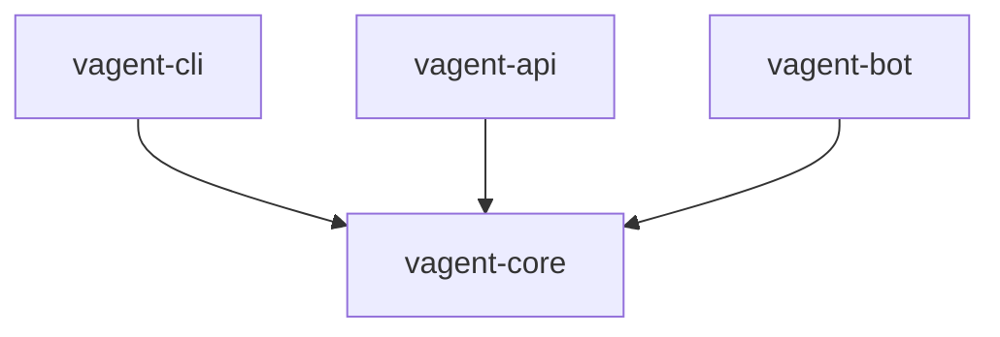
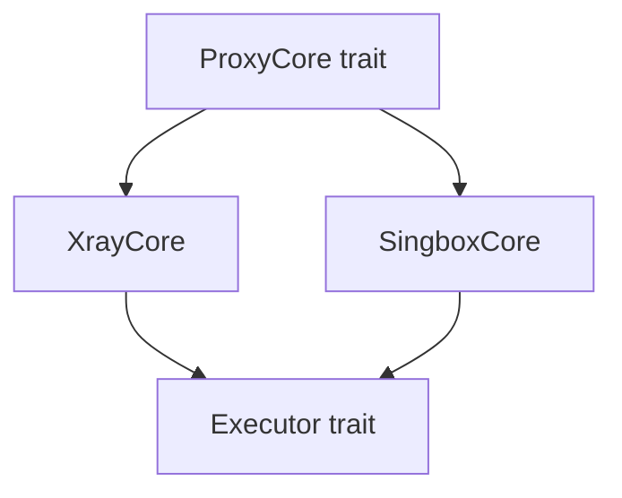
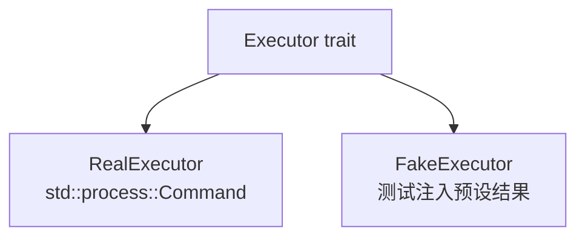
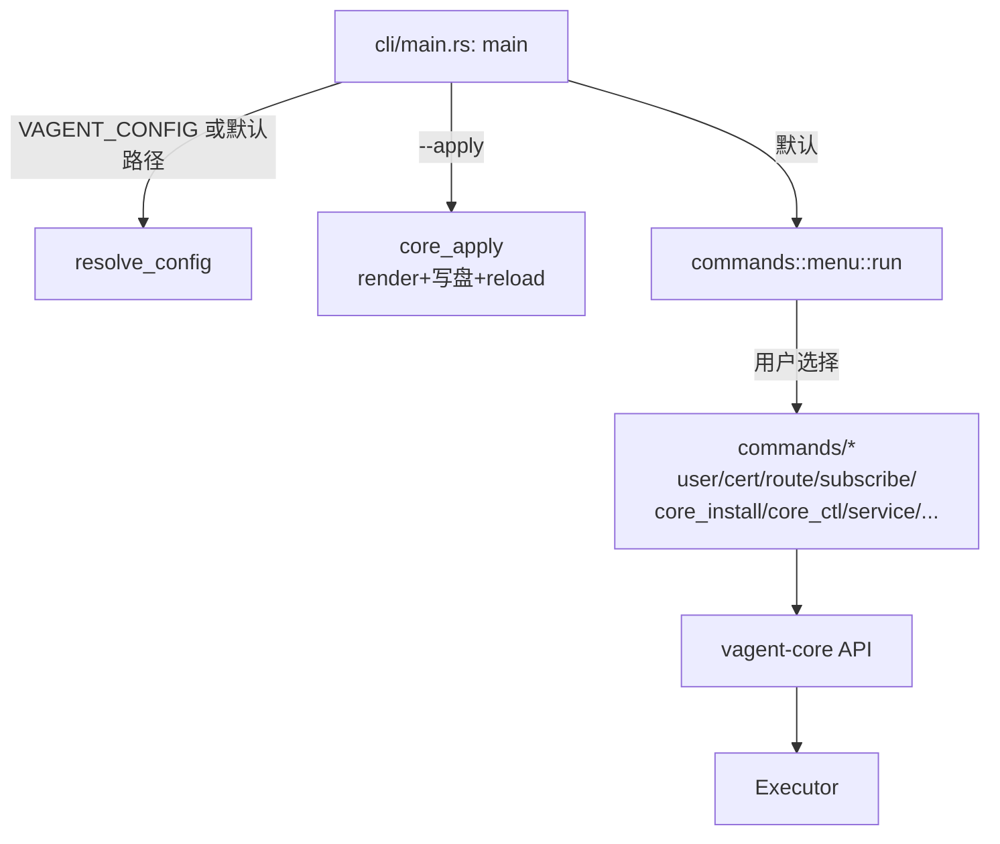
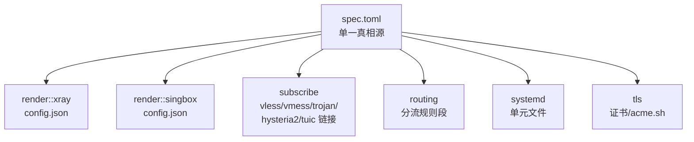
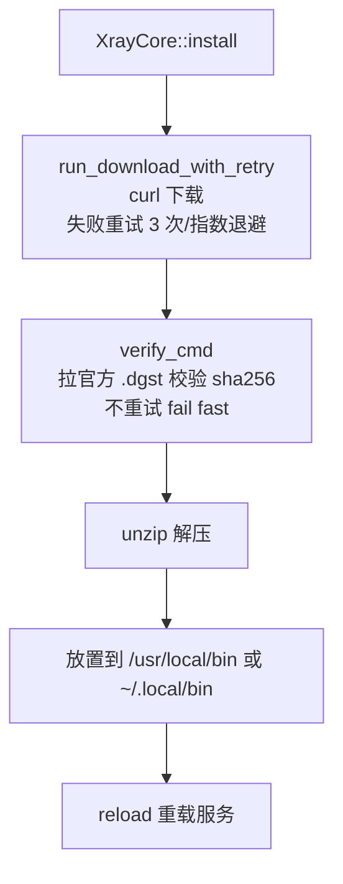

# vagent 架构文档（rust-code-navigator / rust-call-graph 生成）

> 本文档由 `actionbook/rust-skills` 的 `rust-code-navigator` + `rust-call-graph` 方法论生成，
> 基于仓库真实代码结构（crates/ 布局、trait 定义、调用链），非编造。
> 用途：给贡献者快速建立代码地图。

## 1. Workspace 结构

vagent 是 Cargo workspace，4 个 crate 共享 `vagent-core`：

```
vagent (workspace)
├── crates/core    → vagent-core   (共享核心库:spec/render/subscribe/routing/tls/systemd/download)
├── crates/cli     → vagent        (命令行二进制:交互菜单 + --apply 非交互)
├── crates/api     → vagent-api    (axum loopback API + 零 JS 面板)
└── crates/bot     → vagent-bot    (Teloxide bot,publish=false,暂未接入发布)
```

依赖方向（单向，无环）：



## 2. 核心抽象层（core）

### 2.1 ProxyCore trait —— 双核统一接口

`crates/core/src/core/mod.rs` 定义 `ProxyCore`，Xray / sing-box 双核实现同一抽象：



关键方法（全部经 `&dyn Executor` 出口系统副作用）：
- `render(spec, config) -> Rendered` —— 渲染内核配置
- `install_cmd(version) -> Cmd` / `install(version, ex)` —— 下载+校验+解压+放置
- `reload_cmd() -> Cmd` / `reload(ex)` —— 重载服务
- `lifecycle(action, ex)` —— start/stop/restart/enable/disable

### 2.2 Executor trait —— 副作用隔离（测试可注入）



`core` 只构造 `Cmd`（意图），由 `Executor` 执行。测试用 `FakeExecutor` 注入结果，
真实环境用 `RealExecutor`。这是架构的**关键解耦点**（见审计 R3/R6）。

## 3. 应用层调用链

### 3.1 CLI（vagent 二进制）

零命令行参数，直接进交互菜单；`--apply` 走非交互渲染路径。



命令模块（`crates/cli/src/commands/`）：
`apply` · `cert` · `core_ctl` · `core_install` · `menu` · `reality` · `route` ·
`scan` · `service` · `status` · `subscribe` · `uninstall` · `user`

### 3.2 API（vagent-api 二进制）

axum loopback（127.0.0.1:7800），Bearer 鉴权（`VAGENT_API_TOKEN`）。

```mermaid
graph TD
    router[router] --> index[/ → serve_index]
    router --> status[/api/status GET]
    router --> render[/api/render GET]
    router --> users[/api/users POST]
    status --> handlers[api_status]
    render --> handlers[api_render]
    users --> handlers[api_add_user]
    handlers --> auth[auth_layer<br/>Bearer 校验]
    handlers --> core[vagent-core API]
    core --> exec[Executor]
```

路由（`crates/api/src/main.rs`）：
- `GET  /` → `serve_index`（零 JS 面板）
- `GET  /api/status` → `api_status`
- `GET  /api/render` → `api_render`
- `POST /api/users` → `api_add_user`（端口唯一性校验，不硬编码 reality）

## 4. 渲染管线（spec 单一真相源）

所有内核配置/订阅/分流都从一份 `spec.toml` 渲染得出：



`spec.toml` 的 `User` 含 `require_reality_keys()` 单一入口（审计/rust-skills 重构产物），
reality 公钥检查只在此处定义，gen_user / vless_reality / bundle 复用。

## 5. 关键数据流：内核安装（含重试）

`XrayCore::install` 的四步流程，仅下载步骤可重试（m13-domain-error）：



- **transient**（网络抖动）→ 下载步骤重试（1/4/9s 指数退避，最多 3 次）
- **permanent**（校验失败=内容损坏）→ 不重试，直接失败

## 6. 符号索引（rust-code-navigator 风格）

| 符号 | 类型 | 定义位置 |
|------|------|---------|
| `ProxyCore` | trait | `crates/core/src/core/mod.rs` |
| `Executor` | trait | `crates/core/src/executor.rs` |
| `RealExecutor` | struct | `crates/core/src/executor.rs:99` |
| `FakeExecutor` | struct | `crates/core/src/executor.rs:158` |
| `Cmd` | struct | `crates/core/src/executor.rs:13` |
| `Spec` / `User` | struct | `crates/core/src/spec.rs` |
| `XrayCore` / `SingboxCore` | struct | `crates/core/src/core/{xray,singbox}.rs` |
| `apply()` | fn | `crates/core/src/core/mod.rs:130` |
| `require_reality_keys()` | fn | `crates/core/src/spec.rs` |
| `run_download_with_retry()` | fn | `crates/core/src/core/xray.rs` |

## 7. 调用图洞察（rust-call-graph 风格）

**入口点**：`cli/main.rs::main`、`api/main.rs::main`、各 `#[test]` 函数
**叶子函数**：`sha256_hex`、`parse_dgst_sha256`、`Cmd::display`、`require_reality_keys`
**热路径（安装）**：`main → menu → core_install::run → XrayCore::install → run_download_with_retry → Executor::run`
**扇出最高**：`core::apply`（渲染所有启用内核 + 写盘 + 重载）

## 8. 测试架构（贡献者须知）

- **core 单测**：`crates/core/src/*/tests` + `crates/core/src/*_test.rs` 风格（纯函数 + FakeExecutor 注入）
- **cli 集成测试**：`crates/cli/tests/cli_integration.rs`（黑盒，`VAGENT_TEST_INPUT` 驱动菜单）
- **api 集成测试**：`crates/api/src/main.rs` `#[cfg(test)]`（axum oneshot + 真实 HTTP）
- **禁止**：Playwright 套 CLI 本体（遵循项目约定，仅浏览器面板用）

---

*生成工具：actionbook/rust-skills（rust-code-navigator + rust-call-graph 方法论）*
*数据来源：仓库真实代码结构（crates/、trait 定义、调用关系），非 LLM 臆测。*
